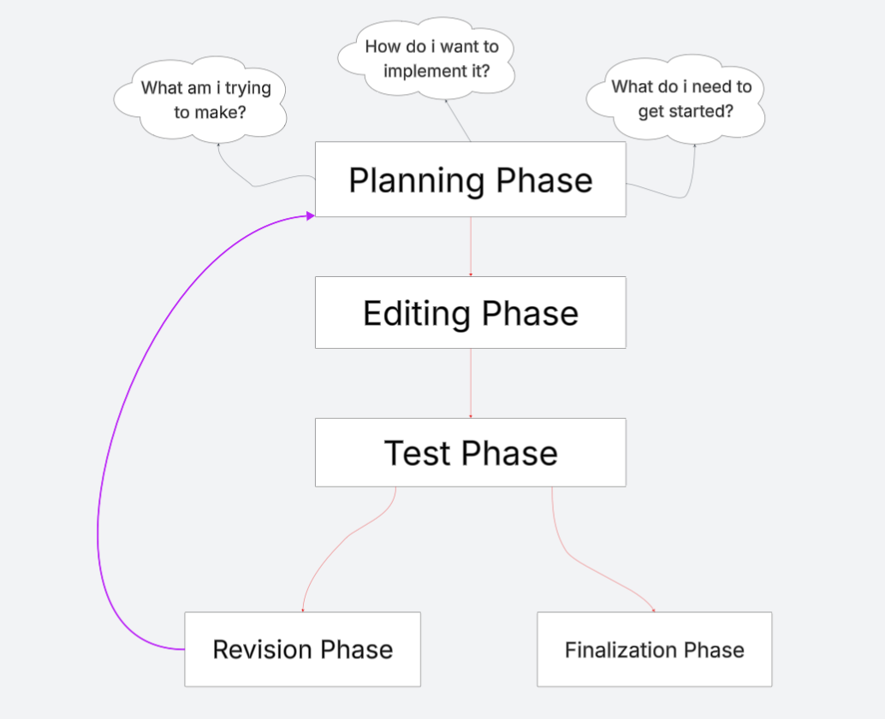

# Here is a breakdown of coding guidelines this project will try to best follow (May mess it up a bit by accident but i hope to catch it and fix it fast.) Again everything listed is for this project specifically.

## Structure



## Indentation
- Use Tab to make indentation
- NEVER use spaces for efficiency  

## Type
- Use PascalCase for type names
- Use camelCase for function and method names
- Use camelCase for property names and local variables
- Use whole words in names when possible (or simplified words if its easier to read)

## Styling
- Open curly braces start at the end of the current code

  Example:
  ```
   for (int i = 1; i <= 5; i++)
          {
              Console.WriteLine("Number: " + i);
          }
  ```
- Use "Double Quotations" for strings

  ## More may be added soon
